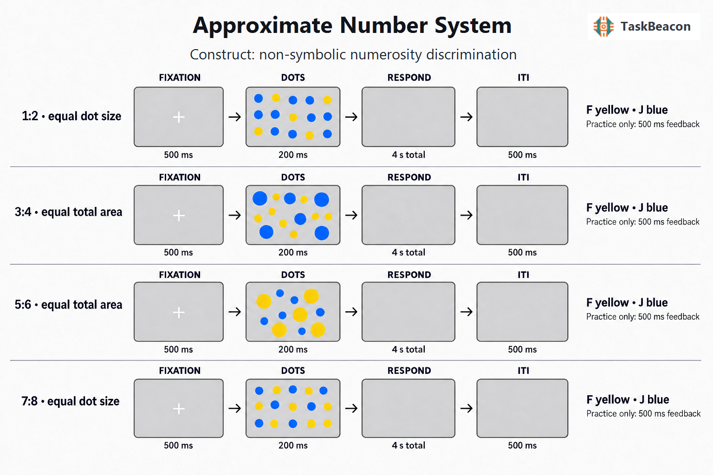

# Approximate Number System Task

TaskBeacon `T000096` implements a reference-aligned, non-symbolic numerosity comparison task with briefly flashed, spatially intermixed blue and yellow dot sets.

## 1. Task Overview

Participants judge which color contains more dots. The task measures Approximate Number System (ANS) acuity through accuracy and response time across four numerical ratios. The canonical human protocol contains two blocks, each with 10 practice and 40 test trials, following Halberda, Mazzocco, and Feigenson (2008).

| Field | Value |
|---|---|
| Name | Approximate Number System |
| Task ID | `T000096` |
| Slug | `approximate-number-system-task` |
| Version | `v0.1.0` |
| Date Updated | 2026-08-23 |
| PsyFlow Version | `0.1.12` |
| PsychoPy Version | `2025.2.4` |
| Modality | Behavioral |
| Acquisition | Behavioral |
| Language | Chinese |
| Response | `F` = yellow; `J` = blue |
| Primary outcomes | Accuracy and RT by ratio/control mode; downstream Weber fraction |

## 2. Task Flow



### Block-Level Flow

`Instruction -> Block 1 (10 practice + 40 test) -> Break -> Block 2 (10 practice + 40 test) -> Summary`

### Trial-Level Flow

`Fixation (500 ms) -> intermixed blue/yellow dots (200 ms) -> blank response window (up to 4 s total, only when unanswered) -> practice-only feedback (500 ms) -> blank ITI (500 ms)`

Test trials do not provide correctness feedback. Practice trials precede test trials within each block and are excluded from task summaries.

### Controller Logic

No adaptive controller is used. A deterministic, seeded session planner balances ratio, more-numerous color, and visual-control mode. Exact dot counts and stimulus seeds are fixed before `run_trial` receives a trial.

### Other Logic

The four ratios are `1:2`, `3:4`, `5:6`, and `7:8`, using 5–16 dots per color. Half of the test trials equalize average dot size; half equalize cumulative blue/yellow dot area. The dot renderer jointly places both colors in one circular aperture without overlap.

## 3. Configuration Summary

### a. Subject Info

| Field | Human profile |
|---|---|
| Subject ID | Three digits, 101–999 |
| Age | 18–80 |
| Gender | Male / female / other |

### b. Window Settings

| Parameter | Value |
|---|---|
| Resolution | 1280 × 800 |
| Units | Degrees of visual angle |
| Background | Gray (`#707070`) |
| Monitor geometry | 35.5 cm width at 57 cm distance |

### c. Stimuli

| Component | Value |
|---|---|
| Dot colors | Blue `#2196F3`; yellow `#FFEB3B` |
| Aperture | Centered circular region, 7° radius |
| Default dot diameter | 0.65° |
| Minimum edge gap | 0.10° |
| Number range | 5–16 per color |

### d. Timing

| Phase | Duration |
|---|---:|
| Fixation | 500 ms |
| Dot array | 200 ms |
| Total response deadline | 4,000 ms from dot onset |
| Practice feedback | 500 ms |
| ITI | 500 ms |

### e. Triggers

The structured trigger map includes experiment/block lifecycle events, fixation, 16 ratio × color × visual-control dot onsets, yellow/blue responses, timeout, practice outcomes, and ITI.

### f. Adaptive Controller

None. Condition generation is a reproducible, preplanned balancing procedure documented in `references/task_logic_audit.md`.

### Running the task

```powershell
python main.py human
python main.py qa --config config/config_qa.yaml
python main.py sim --config config/config_scripted_sim.yaml
python main.py sim --config config/config_sampler_sim.yaml
```

## 4. Methods (for academic publication)

Participants completed a non-symbolic numerosity comparison task based primarily on Halberda, Mazzocco, and Feigenson (2008). On each trial, a central fixation preceded a 200-ms display containing spatially intermixed blue and yellow dots. Participants pressed `F` when yellow dots were more numerous and `J` when blue dots were more numerous. The compared numerosities ranged from 5 to 16 per set, and the larger-to-smaller ratios were 2.00, 1.33, 1.20, and 1.14 (the canonical `1:2`, `3:4`, `5:6`, and `7:8` pairs). The more-numerous color was balanced. On half of trials, both colors shared the same average dot size; on half, cumulative dot area was equated between colors. Dot positions were deterministically sampled without overlap in a shared aperture. Responses were accepted for up to 4 s from stimulus onset, adapting the response-time boundary reported by Halberda et al. (2012). The protocol comprised two blocks, each with 10 practice trials and 40 test trials. Accuracy and reaction time were recorded with ratio, exact counts, color, visual-control mode, and stimulus seed for every logical trial.

## References

- Halberda, J., Mazzocco, M. M. M., & Feigenson, L. (2008). Individual differences in non-verbal number acuity correlate with maths achievement. *Nature, 455*, 665–668. https://doi.org/10.1038/nature07246
- Halberda, J., Ly, R., Wilmer, J. B., Naiman, D. Q., & Germine, L. (2012). Number sense across the lifespan as revealed by a massive Internet-based sample. *PNAS, 109*, 11116–11120. https://doi.org/10.1073/pnas.1200196109
- DeWind, N. K., Adams, G. K., Platt, M. L., & Brannon, E. M. (2015). Modeling the approximate number system to quantify the contribution of visual stimulus features. *Cognition, 142*, 247–265. https://doi.org/10.1016/j.cognition.2015.05.016
